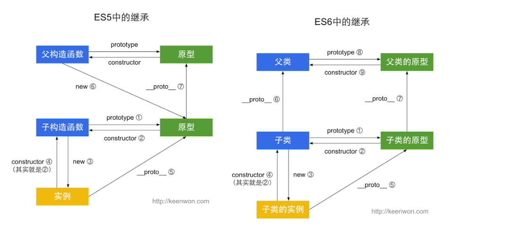

# 题库
题目在前, 答案在后
    
## 题目

### 第 1 题: 写 React / Vue 项目时为什么要在列表组件中写 key，其作用是什么？
解析: [思路](#第1题:)

### 第 2 题: ['1', '2', '3'].map(parseInt) what & why ?
解析: [思路](#第2题:)

### 第 3 题：什么是防抖和节流？有什么区别？如何实现？
解析: [思路](#第3题:)

### 第 4 题：介绍下 Set、Map、WeakSet 和 WeakMap 的区别？
解析: [思路](#第4题:)

### 第 5 题：介绍下深度优先遍历和广度优先遍历，如何实现？
解析: [思路](#第5题:)

### 第 6 题：请分别用深度优先思想和广度优先思想实现一个拷贝函数？
解析: [思路](#第6题:)

### 第 7 题：ES5/ES6 的继承除了写法以外还有什么区别？
解析: [思路](#第7题:)

### 第 8 题：setTimeout、Promise、Async/Await 的区别
解析: [思路](#第8题:)

### 第 9 题：Async/Await 如何通过同步的方式实现异步
解析: [思路](#第9题:)


### 第 10 题：异步笔试题
> 请写出下面代码的运行结果
```javascript
    async function async1() {
        console.log('async1 start');
        await async2();
        console.log('async1 end');
    }
    async function async2() {
        console.log('async2');
    }
    console.log('script start');
    setTimeout(function() {
        console.log('setTimeout');
    }, 0)
    async1();
    new Promise(function(resolve) {
        console.log('promise1');
        resolve();
    }).then(function() {
        console.log('promise2');
    });
    console.log('script end');
```
解析: [思路](#第10题:)


### 第 11 题：算法手写题
> 已知如下数组：
> 
> var arr = [ [1, 2, 2], [3, 4, 5, 5], [6, 7, 8, 9, [11, 12, [12, 13, [14] ] ] ], 10];
> 
> 编写一个程序将数组扁平化去并除其中重复部分数据，最终得到一个升序且不重复的数组
解析: [思路](#第11题:)


### 第 12 题：JS 异步解决方案的发展历程以及优缺点。
解析: [思路](#第12题:)


### 第 13 题：Promise 构造函数是同步执行还是异步执行，那么 then 方法呢？
解析: [思路](#第13题:)


### 第 14 题：如何实现一个 new 操作符?
解析: [思路](#第14题:)


### 第 15 题：简单讲解一下http2的多路复用
解析: [思路](#第15题:)


### 第 16 题：谈谈你对TCP三次握手和四次挥手的理解
解析: [思路](#第16题:)


### 第 17 题：A、B 机器正常连接后，B 机器突然重启，问 A 此时处于 TCP 什么状态
> 如果A 与 B 建立了正常连接后，从未相互发过数据，这个时候 B 突然机器重启.
> 问 A 此时处于 TCP 什么状态？如何消除服务器程序中的这个状态？（超纲题，了解即可）
解析: [思路](#第17题:)


### 第 18 题：React 中 setState 什么时候是同步的，什么时候是异步的？
解析: [思路](#第18题:)


### 第 19 题：React setState 笔试题，下面的代码输出什么？
```javascript
    class Example extends React.Component {
        constructor() {
            super();
            this.state = {
                val: 0
            };
        }
        
        componentDidMount() {
            this.setState({val: this.state.val + 1});
            console.log(this.state.val);    // 第 1 次 log

            this.setState({val: this.state.val + 1});
            console.log(this.state.val);    // 第 2 次 log

            setTimeout(() => {
                this.setState({val: this.state.val + 1});
                console.log(this.state.val);  // 第 3 次 log

                this.setState({val: this.state.val + 1});
                console.log(this.state.val);  // 第 4 次 log
            }, 0);
        }

        render() {
            return null;
        }
    };
```
解析: [思路](#第19题:)


### 第 20 题：介绍下 npm 模块安装机制，为什么输入 npm install 就可以自动安装对应的模块？
解析: [思路](#第20题:)


### 第 21 题：有以下 3 个判断数组的方法，请分别介绍它们之间的区别和优劣
Object.prototype.toString.call() 、 instanceof 以及 Array.isArray()
解析: [思路](#第21题:)


### 第 22 题：介绍下重绘和回流(重排)（Repaint & Reflow），以及如何进行优化
解析: [思路](#第22题:)


### 第 23 题：介绍下观察者模式和订阅-发布模式的区别，各自适用于什么场景
解析: [思路](#第23题:)


### 第 24 题：聊聊 Redux 和 Vuex 的设计思想
解析: [思路](#第24题:)


### 第 25 题：浏览器和Node 事件循环的区别
解析: [思路](#第25题:)


### 第 26 题：介绍模块化发展历程
可从IIFE、AMD、CMD、CommonJS、UMD、webpack(require.ensure)、ES Module、&lt;script type="module"&gt; 这几个角度考虑。
解析: [思路](#第26题:)


### 第 27 题：全局作用域中，用 const 和 let 声明的变量不在 window 上，那到底在哪里？如何去获取？
解析: [思路](#第27题:)


### 第 28 题：cookie 和 token 都存放在 header 中，为什么不会劫持 token？
解析: [思路](#第28题:)


### 第 29 题：聊聊 Vue 的双向数据绑定，Model 如何改变 View，View 又是如何改变 Model 的
解析: [思路](#第29题:)


### 第 30 题：两个数组合并成一个数组
请把两个数组 ['A1', 'A2', 'B1', 'B2', 'C1', 'C2', 'D1', 'D2'] 和 ['A', 'B', 'C', 'D']，合并为 ['A1', 'A2', 'A', 'B1', 'B2', 'B', 'C1', 'C2', 'C', 'D1', 'D2', 'D']。
解析: [思路](#第30题:)


----------------------------


## 思路

### 第1题:
考察`diff算法`对数组模板的处理        

tag: [diff算法](http://hcysun.me/vue-design/zh/renderer-diff.html#%E5%87%8F%E5%B0%8Fdom%E6%93%8D%E4%BD%9C%E7%9A%84%E6%80%A7%E8%83%BD%E5%BC%80%E9%94%80)

数据模型为数组时, 有/无key的两种不同diff方案
- 无key
    1. 数据位置替换时, `就地复用`原来的子节点, 仅更新被观察的属性
    2. 数据增删时, `就地复用`原来的子节点, 仅更新被观察的属性, 再添加或删除节点
    3. 在简单模板的情况下, 速度较有key会快一点, 因为可以有效复用节点,不用在节点增删上消耗时间.     
- 有key
    1. 数据位置替换时, 根据key找到对应dom, dom节点位置进行交换
    2. 数据增删时, 删除被删掉的dom节点, 重新生成带有新key的dom节点
    3. 可以更准确(根据key对比), 更快速(key可以组成map对象)获取到对应的节点

答案: [详细答案](https://github.com/Advanced-Frontend/Daily-Interview-Question/issues/1)


### 第2题:
考察`Array.prototype.map` 和 `parseInt`的参数
tag: Array, parseInt, 进制

- Array.prototype.map(callback)
    - callback(currentValue, index, currentArray)
        - currentValue
        - index
        - currentArray

- parseInt(string, radix)   把字符串string当做radix进制的值,  返回string在十进制下的数值
    - string,  被处理的字符串
    - radix,   解析时的基数, 范围: [2, 36]


```javascript
[1,2,3].map(parseInt)       // [1, NaN, NaN]
// 相当于
[
    parseInt(1, 0),         // 1, 基数为0时, string不以"0x"或"0"开头, 则基数为10
    parseInt(2, 1),         // NaN, radix范围不正确, 1不在[2, 36]内
    parseInt(3, 2)          // NaN, 3 不是有效地二进制值
]


// 变式:
let unary = fn => val => fn(val)        // let unary = fn => (val, index) => fn(val, index)
let parse = unary(parseInt)
console.log(['1.1', '2', '0.3'].map(parse))

```
[parseInt方法](https://developer.mozilla.org/zh-CN/docs/Web/JavaScript/Reference/Global_Objects/parseInt)


### 第3题:
考察 异步编程, 优化思路, 闭包       
tag: setTimeout, 防抖节流, 闭包

- 防抖: 请求需要在一定时间内不重复触发, 之后才会执行, 如果在这个时间内又发送请求则重新计算时间
- 节流: 请求在一定时间区间内只会执行一次, 
```javascript
// 防抖
function debounce(fn, ms, ...args){
    let timeoutId = 0
    return e => {
        if(timeoutId) clearTimeout(timeoutId)
        // setTimeout 函数内的上下文为window, 所以需要绑定上下文
        timeoutId = setTimeout(() => fn.apply(this, [e, ...args]), ms)  
    }
}

// 节流
function throttle(fn, ms, ...args){
    let time = 0
    return e => {
        if(Date.now() - time < ms) return
        time = Date.now()
        setTimeout(() => fn.apply(this, [e, ...args]), ms) 
    }
}
```


### 第4题:
考察 ES6        

- Set: 成员不重复的类似数组的数据结构
- Map: 可以以任意值(包括引用类型的值))为key的数据结构
- WeakSet: `成员只能是对象且对成员的引用为弱引用`, 不计入引用次数, 成员可以被回收,  不能遍历不能清空
- WeakMap: 与Map不同的点是, `key只能是对象且对key的引用为弱引用`, 不计入引用次数, key可以被回收, 不能遍历不能清空

共同特点:         
1. 无法直接与JSON相互转换    
    

### 第5题:
考察 算法, DFS, BFS

- 深度优先遍历(DFS)      
    1. 从根节点起,选择某一个分支, 一直往子分支迭代,直到尽头再重新回到路线最初的分叉点从新开始迭代另一分支
    2. 可以用`递归`或`栈`实现
- 广度优先遍历(BFS)      
    1. 从根节点起, 先迭代同一层级的子分支, 然后再迭代子分支的子分支(孙代分支).
    2. 可以用`队列`实现

```javascript
// 假设节点都在children数组中

// 深度优先遍历(DFS)      递归
function dfs(node, nodeList = []){
    if(node){
        nodeList.push(node)
        let children = node.children
        for(let v of children){
            dfs(v, nodeList)
        }
    }
    return nodeList
}

// 广度优先遍历(BFS)      队列
function bfs(node){
    let nodes = []
    let stacks = []
    if(node){
        stacks.push(node)
        while (stacks.length) {
            node = stacks.shift()
            nodes.push(node)
            for(let childNode of node.children){
                stacks.push(childNode)
            }
        }
    }
    return nodes
}

```


### 第6题:
考察 拷贝函数, DFS, BFS
- 深拷贝函数, 需要注意的点:
    - Object
        - object
        - array
        - Map/Set
        - 其他类型及其原型链(Date, RegExp...)
    - Symbol
    - function
    - 内部引用的处理
```javascript
    function getEmpty(o) {
        let constructor = o.constructor
        if(constructor == Object) return {}
        else if(constructor == Array) return []
        else if(constructor == Date) return new Date(o)
        else if(constructor == RegExp) return new RegExp(o)
        else if(constructor == Map) return new Map(o)       // 浅复制
        else if(constructor == Set) return new Set(o)       // 浅复制
        return o;
    }

    // DF 深度优先   栈实现
    function deepCopy_df_stack(param) {
        let res = getEmpty(param)
        let quoteMap = new WeakMap()
        let stacks = []
        if(typeof param == "object"){
            if(quoteMap.has(param)) return quoteMap.get(param)
            quoteMap.set(param, res)
            stacks.push([param, res])
        }else if(typeof param == "function"){
            res = eval('(' + param.toString() + ')')
        }

        while (stacks.length) {
            let [ori, tar] = stacks.pop()       // 先进后出
            for(let key in ori){
                if(quoteMap.get(ori[key])){
                    tar[key] = quoteMap.get(ori[key])
                    continue
                }
                
                tar[key] = getEmpty(ori[key])
                if (typeof ori[key] == "object"){
                    stacks.push(ori[key], tar[key])
                    quoteMap.set(ori[key], tar[key])
                } else if (typeof param == "function") {
                    res = eval('(' + param.toString() + ')')
                }
            }
        }
        return res
    }

    // BF 广度优先   队列实现
    function deepCopy_bf_queue(param) {
        let res = getEmpty(param)
        let quoteMap = new WeakMap()
        let queue = []
        if (typeof param == "object") {
            if (quoteMap.has(param)) return quoteMap.get(param)
            quoteMap.set(param, res)
            queue.push([param, res])           
        } else if (typeof param == "function") {
            res = eval('(' + param.toString() + ')')
        }

        while (queue.length) {
            let [ori, tar] = queue.shift()      // 先进先出
            for (let key in ori) {
                if (quoteMap.get(ori[key])) {
                    tar[key] = quoteMap.get(ori[key])
                    continue
                }

                tar[key] = getEmpty(ori[key])
                if (typeof ori[key] == "object") {
                    queue.push(ori[key], tar[key]) 
                    quoteMap.set(ori[key], tar[key])
                } else if (typeof param == "function") {
                    res = eval('(' + param.toString() + ')')
                }
            }
        }
        return res
    }
```


### 第7题:
考察 ES6, Class, 继承, 原型

- ES5继承
    - 原型链继承  
        - 将一个父类的实例赋值给子类的构造函数的原型。
        - 实例的constructor依然指向父类的构造函数
        - 所有实例都共享同一个父类原型, 修改原型上的引用属性会影响所有子类
    - 构造函数继承  
        - 在子类的构造函数内部调用父类构造函数, 通过使用apply或call方法调用可以在子类实例化的时候执行父类构造函数
        - 可以传递属性, 父类的属性会设置在子类上
        - 父类中定义的方法子类实例无法调用, 同样的方法都要在子类上写一遍
    - 组合式继承  
        - 既使用原型链实现对原型属性和方法的继承，用借用构造函数模式实现对实例属性的继承.
        - 原型上定义的方法可以复用, 每个实例也都有自己的属性
        - 需要调用两次父类构造函数
    - 原型式继承
        - 改造`原型链继承`, 不使用父类的构造函数创建实例, 使用父类的原型创建新的对象作为子类实例
        - Object.create(proptotype, childObj)
        - 与`原型链继承`有一样的缺点, 修改父类原型上的引用属性会影响所有子类
    - 寄生式继承
        - 在`原型式继承`的基础上为对象添加函数, 增强对象
        - 无法函数复用, 与`构造函数继承`类似
    - 寄生组合式继承
        - `寄生式继承`和`组合式继承`的结合, 借助`构造函数`继承属性, 又用过`原型链`继承方法
        - 与`组合式继承`的主要区别在于 前者原型使用的是父类的一个副本, 后者直接使用父类的实例作为原型
        - 只调用一次父类构造函数, 子类原型上不需要创建多余的属性, 原型链可以保持不变, 可以正常使用instanceof isPrototypeOf 方法.
- class
    - `寄生组合式继承`的语法糖
    - class之间使用`extends`关键字继承, 子类的constructor中必须调用super方法猴才能使用this, 因为子类没有自己的this对象,而是继承父类的this对象
- 区别点
    1. `class` 声明会提升, 但是不会赋值, 会进入暂时性死区(TDZ), 类似于`let`, `const`
    2. `class` 内部会启用严格模式
    3. `class` 所有方法都是不可枚举的, 也没有原型对象,所以无法使用`new`来调用
    4. `class` 内部无法重写类名。
```javascript
    //寄生组合式继承
    function inheritPrototype(subType, superType){
        let prototype = Object.create(superType)    // 创建副本对象
        prototype.constructor = subType             // 增加对象, 改变构造函数的指向
        subType.prototype = prototype               // 指向原型
    }

    function superType(name){
        this.name = name
        this.colors = ["red", "green", "blue"]
    }
    superType.prototype.sayName = function (){
        console.log(this.name)
    }

    function subType(name, age){
        superType.call(this, name)          // 继承属性
        this.age = age
    }
    
    inheritPrototype(subType, superType)    // 继承方法
    subType.prototype.sayAge = function(){
        console.log(this.age)
    }


    // ES6
    class SuperType{}
    class SubType extends SuperType{}
    SubType.__proto__ === SuperType                         //true, 继承属性
    SubType.prototype.__proto__ === SuperType.prototype     //true, 继承方法

    // 因为 
    // SubType.prototype.__proto__ === SuperType.prototype 
    // sub.__proto__ == SubType.prototype 
    // 所以
    let sub = new SubType()
    sub.__proto__.__proto__ === SuperType.prototype         // true
```



### 第8题:
考察 异步, EventLoop
- macrotask queue
    - 宏任务队列: 本质是浏览器多个线程之间通信的一个消息队列, 可能会有多个宏队列
    - 属于宏任务的有: setTimeout, setInterval, setImmediate, requestAnimationFrame
- microtask queue
    - 微任务队列: 只有一个队列, `每执行一个宏任务后`,都会执行为任务队列中的所有任务内容
    - 属于微任务的有: MutationObserver, promise的回调, process.nextTick


### 第9题:
考察 async/await, generator

- 借助ES6的`generator`函数, 包装了`yield`操作符与`next`方法, 使其看起来像是同步的代码
- 基本原理如下: [bAsync](../code/doOneself/bAsync/bAsync.js)


### 第10题:
考察 EventLoop, 异步

```
----------------- macrotask 开始
script start
async1 start
async2
promise1
script end
----------------- macrotask 结束
----------------- microtask 开始
async1 end
promise2
----------------- microtask 结束
----------------- macrotask 开始
setTimeout
----------------- macrotask 结束
```
[变式-举一反三](https://github.com/Advanced-Frontend/Daily-Interview-Question/issues/7)


### 第11题:
考察 数组去重
```javascript

var arr = [ [1, 2, 2], [3, 4, 5, 5], [6, 7, 8, 9, [11, 12, [12, 13, [14] ] ] ], 10];
//编写一个程序将数组扁平化去并除其中重复部分数据，最终得到一个升序且不重复的数组

// 借组对象
function flagSort(arr, obj = {}){
    for(let v of arr){
        if(Array.isArray(v)) flag(v, obj)
        else obj[v] = null
    }
    return Object.keys(obj).map(v => ~~v).sort((a, b) => a - b)
}

// 借助 Set 和 flag
function flag_native(arr){
    return [...new Set(arr.flat(Infinity))].sort((a, b) => a - b)
}

// 使用reduce 和concat 模拟 flag
function arrayFlag(arr){
    return arr.reduce((acc, val) => {
        if(Object.prototype.toString.call(val) == "[object Array]"){
            console.log(acc)
            return acc.concat(arrayFlag(val))   // 需要return 数组
        }else{
            console.log(acc)
            return acc.concat(val)              // 需要return 数组
        }
    }, [])
}

```


### 第12题:
考察: 异步解决方案有几种

- 回调: 通过传递回调函数, 响应时执行回调函数
    - 优点: 简单解决了同步的问题
    - 缺点: 回调地狱(反人类思维, 耦合度高, 难以处理错误), 不能捕获错误, 不能return

- Promise: ES6的Promise语法
    - 优点: 可以避免回调嵌套
    - 缺点: 无法取消Promise

- Async/Await: ES7的语法, 基于Promise和Generator
    - 优点: 可以用同步风格的语法来写异步代码
    - 缺点: 无关联的异步函数, 用同步的语法来写会导致性能下降


### 第13题:
考察: promise  

构造函数是同步执行的, then是异步的microTask, 在当前任务完成的时候执行.


### 第14题:
考察: new操作符 构造函数  

```javascript
// new 做了什么?
// 1. 创建一个空对象
// 2. 空对象连接构造函数的原型
// 3. 构造函数参数传递, 将this指向新对象
function _new(conFn, ...args){
    const obj = Object.create(conFn.prototype)
    const ret = conFn.apply(obj, args)
    return ret instanceof conFn ? ret : obj     // 判断 Date, regexp, Array 之类的构造函数返回值 
}

```

### 第15题:
考察: HTTP2 多路复用  

1. HTTP2的特点: 二进制协议, 多工, 数据流, 头信息压缩, 服务器推送
2. 什么是多路复用? 连接不会断开, 而且支持同时发送多个请求, 顺序可以不一一对应, 且不会阻塞
3. 实现原理? HTTP2的数据流都必须标记数据ID, 根据数据ID 可以找到对应的请求/响应值, 所以支持多路复用
4. 与HTTP1.1的 `Keep Alive` 有什么区别? 在Keep Alive的基础上增加了多路复用的功能, 而且HTTP2还支持头信息压缩, 服务器推送


### 第16题:
考察: TCP 三次握手四次挥手  
- A为客户端 , B为服务端
- 建立连接: A发送请求(SYN) --> B响应返回(SYN/ACK) -->  A接收后发送(ACK)  

- 断开连接: A发送请求(FIN) --> B响应返回(ACK) --> B做好关闭准备发送(FIN) --> A接收后发送(ACK)           


### 第17题:
考察: TCP   

- 从未相互发过数据: ESTABLISHED 
- 已发过数据: ESTABLISHED
- B端重启, A端状态: TCP没有正常关闭, 超时后, A端会发送FIN 断开请求等待回复的状态, FIN WAIT
- 如何消除A端的状态?


### 第18题:
考察: React  State


这里的异步/同步指的是: 调用setState后, 数据是否立即更新.
- 异步(调用后不会立即就触发更新)  
    由React控制的事件处理函数以及生命周期函数中调用setState不会立即更新的
- 同步(调用后立即触发更新)  
    React控制之外的事件中调用setState是立即更新的,   
    如: js原生绑定事件(addEventListener), setTimeout之类的


### 第19题:
考察: React State   

与18题相似考察React State的更新时机,
``` javascript
// 在react自身生命周期内, 触发时 isBatchingUpdates 为 true
componentDidMount() {
    this.setState({val: this.state.val + 1});               //  val 为 0
    console.log(this.state.val);    // 第 1 次 log              

    this.setState({val: this.state.val + 1});               //  val 为 0
    console.log(this.state.val);    // 第 2 次 log

    setTimeout(() => {
        // 由于前两个state会合并更新,  所以在setTimeou回调触发时, val 为 1
        // isBatchingUpdates 为false,  会立即更新 this.state

        this.setState({val: this.state.val + 1});          //  val 为  2
        console.log(this.state.val);  // 第 3 次 log

        this.setState({val: this.state.val + 1});          //  val 为  3
        console.log(this.state.val);  // 第 4 次 log
    }, 0);
}

// 0 , 0, 2, 3
```


### 第20题:
考察: npm  

npm 模块安装机制
1. 查找依赖的模块: 起始查找文件优先级:  package-lock.json > package.json.  
    根据各个模块的自身的依赖, 可以生成一颗依赖树
2. 确定模块版本: 根据 @(当前版本) 和 ^(向上匹配) 标识符,假如不同的模块都对A模块有依赖
    - 可以找到兼容版本时, 则把这依赖树拍平到根节点, 只需要安装一个版本的A模块就可以
    - 如果找不到兼容版本, 则维持原来的依赖树, 需要安装不同版本的A模块
3. 安装下载: 先从全局缓存中查找, 若找不到则从仓库下载


### 第21题:
考察: Array, 原型判断  

- Object.prototype.toString.call()
    1. 输出对象的内部标签, "[Object Array]"
    2. 可以通过修改对象A的`Symbol.toStringTag`属性来改变结果
- instanceof
    1. A instanceof B , 判断A的原型链中是否包含构造函数B的原型对象
    2. 可以通过修对象A的`Symbol.hasInstance`属性来改变结果
    3. 无法判断来自`iframe`的Array, 因为跟`windows`的Array并非同一个函数, 所以原型对象也不一样
- Array.isArray()
    1. ES5加入的, 最准确的判断方法
    2. 不兼容时需要 Polyfill


### 第22题:
考察: 浏览器渲染 重绘 回流(重排)  

- 浏览器渲染过程
    1. 解析HTML, 生成DOM树; 解析CSS, 生成CSSOM树
    2. 结合DOM树和CSSOM树, 生成渲染树
    3. 进行Layout(重排), 得到各个节点的几何信息(位置, 大小)
    4. Paintin(重绘), 根据渲染树以及重排的几何信息, 得到节点的绝对像素
    5. Display(展示), 把像素发送给GPU, 展示页面.
- 重绘
    1. 页面布局不变化, 仅元素内部分不影响布局的属性调整, 重新绘制元素
- 重排
    1. 布局发生变化, 重排必定导致重绘

- 优化
    1. 避免触发同步布局事件, 减少使用会导致立即重排的属性(offsetTop, offsetLeft, offsetWidth, scrollTop, scrollLeft, clientTop..等)都会立即刷新渲染队列
    2. 使用`class`和`cssText`的方式合并多次对DOM和样式的修改
    3. 脱离文档修改元素: 1.使元素脱离文档流(隐藏/移除; 拷贝生成一个新节点); 2. 修改样式; 3.把元素带回文档流
    4. 复杂动画, 使用绝对定位脱离文档流
    5. CSS3硬件加速, 使部分动画属性不引起重排重绘


- [答案](https://github.com/Advanced-Frontend/Daily-Interview-Question/issues/24)


### 第23题:
考察: 设计模式, 订阅-发布模式, 观察者模式 

- 订阅-发布模式
    - 区别: 有事件调度中心, 订阅者和发布者只需要通过调度中心来交流, 不需要知道对方是谁. 
    - 用途: 1个调度中心对应多个订阅者发布者, 类似于报社,邮局,个人的关系.
- 观察者模式
    - 区别: 发布者和订阅者都需要知道对方的存在
    - 用途: 1对1直接沟通, 类似于个体奶农和个人的直接沟通关系.


### 第24题:
考察: Redux, Vuex

- Redux
    1. 通过纯函数生成新的state
    2. 为了保证每次状态变化都能跟踪, 需要强制immutability, 每次都要生成新的state
    3. 异步需要用chunk中间件
    4. 与之相似的状态管理思想: Flux
- Vuex
    1. 通过commit("method")的方式修改store
    2. 有getter, 方便计算属性复用
    3. 可以直接挂载到根节点, 方便引用
    4. 异步可以使用dispatch(action)的方式,处理完异步后,最终commit(action)
    5. 与之相似的状态管理思想: Mobx
- 设计思想
    0. 全局state保存状态
    1. 单向数据流
    2. state的修改必须是同步的, 否则无法确认修改方法的调用顺序

[Vuex、Flux、Redux、Redux-saga、Dva、MobX的设计思路](https://zhuanlan.zhihu.com/p/53599723)


### 第25题:
考察: EventLoop  

有3种任务队列: marcoTask, microTask, nextTick(node独有)
- 浏览器执行顺序:  
    每执行一个marcoTask, 都会去执行microTaskQueue, 然后再继续执行剩余的marcoTaskQueue
- node11之前:  
    执行完同一个marcoTaskQueue中所有任务, 再执行nextTick, 最后执行microTaskQueue
- node11之后:  
    顺序几乎与浏览器保持一致, 每执行一个marcoTask,先执行nextTick, 然后再会去执行microTaskQueue, 然后再继续执行剩余的marcoTaskQueue


### 第26题:
考察: 模块化

模块化的主要作用是为了抽离公共代码, 隔离作用域, 避免变量冲突.

- IIFE  
    自执行函数, 避免变量冲突

- AMD  
    1. 使用范围: 浏览器
    2. requireJS实现的 
        ```javascript
            define(['module1', 'module2'], (m1, m2) => {
                const newModule = {}
                return newModule
            })
        ```
    3. 特点: 依赖必须提前声明好
- CMD
    1. 使用范围: 浏览器
    2. seaJS实现的
        ```javascript
            define(function(require, exports, module){
                var code = require('./index.js')
                var asyncCode = require.async('./async.js', code => {})
            })
        ```
    3. 特点: 整合, 支持动态引入的依赖文件
- CommonJS  
    1. 使用范围: nodejs, webpack,  
    2. nodejs中自带的模块化, 
    3. 特点: 运行时加载, 返回一个对象

- UMD  
    1. 使用范围:
    2. 语法:
    3. 特点: 兼容AMD, CommonJS的模块化语法

- webpack
    1. 使用范围: 浏览器
    2. 语法:    
        ```javascript
            // method1
            require.ensure()
            // method2
            import().then(code => {})
        ```
    3. 特点: 支持代码切割加载

- ES Module
    1. 使用范围: ES6语法
    2. 语法: import / export
    3. 特点: `静态`加载阶段的引用, ES6模块不是对象, 是对外的一种静态定义

- &lt;script type="module"&gt;
    1. 使用范围: HTML5
    2. 语法参考: [script标签](../note/HTML/Script标签/index.html)


### 第27题:
考察: ES6, 块级作用域  

在ES6的用`let, const`声明的全局变量, 并不属于顶层对象的属性. 因为它其实是在一个全局的块级作用域下, 而并非像ES5中的`var, function`声明在顶层对象里.


### 第28题:
考察: HTTP, cookie, token, CSRF  

- cookie
    1. cookie是请求的时候, 浏览器自动设置到header上的, 可以通过固定的方法去获取它, 容易被CSRF攻击
    2. 不防XSS攻击
- token
    1. token是通过具体的代码人为设置到header上的, 相对没那么容易获取它, 防止CSRF
    2. 不防XSS攻击


### 第29题:
考察: Vue, 双向数据绑定  

利用ES5的`Object.defineProperty` 劫持属性的`getter/setter`, 当数据发生变化时, 触发所有依赖改属性的方法


### 第30题:
考察: 数组, 算法

- 方法1: 合并后, 再排序
    ```javascript
    arr1.concat(arr2).sort((a, b) => {
        let codeA = a.codePointAt(0)
        let codeB = b.codePointAt(0)
        return codeA - codeB
    })
    ```
- 方法2: 统一形式再合并排序, 通用性更强
    ```javascript
        let a1 =  ['A1', 'A2', 'B1', 'B2', 'C1', 'C2', 'D1', 'D2']
        let a2 = ['A', 'B', 'C', 'D'].map((item) => {
        return item + 3
        })

        let a3 = [...a1, ...a2].sort().map((item) => {
        if(item.includes('3')){
            return item.split('')[0]
        }
        return item
        })
    ```