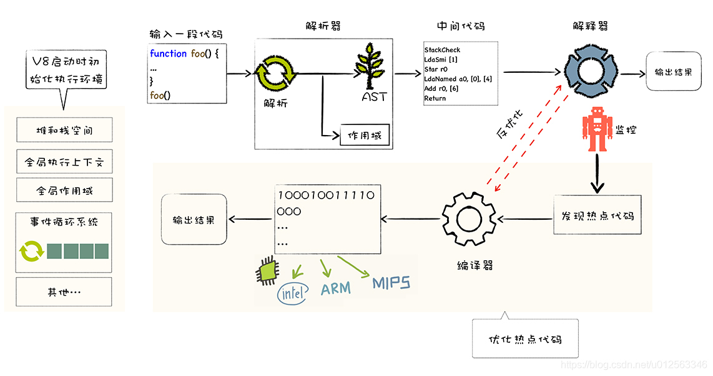

## V8

### 工作流程
1. 输入代码
2. 解析器
    - 解析
    - 转译AST
3. 生成中间代码(字节码)

4. 运行
    - 解析器 -> 输出结果
    - 监控模块监控代码执行频率, 发现热点代码
        - 编译器
        - 生成二进制机器码
        - 输出结果
        - ps: 遇到不稳定的数据结构时(delete操作), 需要从机器码反编译成字节码, 退回解析器解析执行的状态

流程图: 
