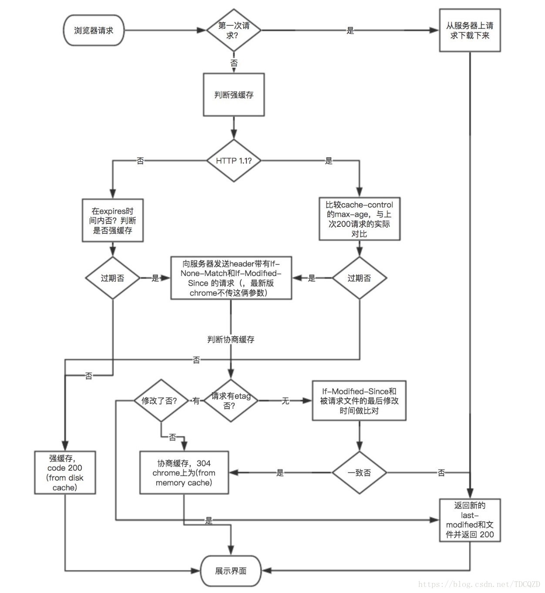

# 请求缓存
请求缓存指的是在浏览器中通过HTTP请求, 如果服务端设置了缓存字段, 则该请求的结果将被缓存到客户端, 设置的缓存类型可以分为 `强缓存` 和 `协商缓存`, 缓存储存的地方可以分为 `Service Worker`, `Memory Cache`, `Disk Cache` 和 `Push Cache`.

## 强缓存
请求时, 检查到强缓存生效时, 直接采用缓存内容, `不需要`发送请求.  

### Expires
首先先说基于 `HTTP1.0` 的 `Expires` 即过期时间, 具体的时间由服务器返回(基于GMT的时间).  在这个时间之前都不需要发请求到服务器.
```
// new Date().toGMTString()
Expires: Mon, 30 Mar 2020 14:59:43 GMT
```
表示资源在世界时的 `2020-03-30 14:59:43` 时过期,  过期后就只能向服务器发出请求.

`Expires` 缺点是: 
1.  `服务器时间与浏览器时间可能不一致`.


### Cache-Control
说一下 `HTTP1.1` 的 `Cache-Control` 字段, 它与 `Expires` 相比, 不再基于某个具体时间点, 而是通过设置过期时长来控制缓存, 而且增加了几个强力的字段用来控制缓存开放.

1. max-age  
    先说控制缓存时长的属性 max-age, 它代表缓存的多少秒后过期.  
    ```
    // 表示1个小时后过期
    Cache-Control: max-age=3600
    ```
2. public  
    客户端和`代理服务器`都可以缓存.
    ```
    // 联动max-age, 表示客户端与代理服务器均可以缓存数据.
    Cache-Control: public;max-age=3600
    ```
3. pivate  
    表示只能浏览器可以缓存.
4. no-cache  
    表示跳过强缓存, 发出HTTP请求, `进入协商缓存阶段`.
5. no-store  
    表示不进行任何形式的缓存.
6. s-maxage  
    表示代理服务器的缓存时间.


### Pragma

HTTP/1.0
no-cache: 不直接使用缓存,根据新鲜度来使用缓存 在HTTP1.1中已经废除
优先级高

强缓存的优先度:  
> Pragma > Cache-Control > Expires

## 协商缓存
聊完强制缓存, 我们开始聊一下协商缓存, 协商缓存主要有两种方式: 基于文件特征的`ETag` 和 基于最后修改时间的 `Last-Modified`

### ETag
`ETag` 是服务端根据文件生成的唯一标识, 只要文件有变化, 这个值就会变化, 通过 `响应头` 把 `ETag` 发送给客户端, 客户端保存下来, 下次发送请求的时候把这个值作为请求头 `If-None-Match` 的值, 发送出去.  
1. 若服务端当前的`ETag` 与请求头的 `If-None-Match` 相匹配, 则返回状态码`304`, 告诉客户端使用缓存.
2. 若无法匹配, 则返回最新内容以及最新的`ETag`.

### Last-Modified
`Last-Modified` 表示服务端最后一次修改文件的时间, `响应头` 上会加上这个字段.  
客户端下次请求是会在请求头把这个值作为请求头 `If-Modified-Since` 的值.  
1. 若服务端中该资源的`最后一次修改的时间` 在请求头的值之后, 就返回最新的值, 走正常的http请求流程.
2. 若在两个时间一样, 则返回`304` 告诉客户端使用缓存.  


### 两者对比
`ETag` 和 `Last-Modified` 作为两种协商缓存的方式, 两种方式各有优劣.  

1. `精准度`: `ETag` 优于 `Last-Modified`, 因为 `Last-modified` 无法准确识别下列两种情况:  
    - 如果同一个资源在一秒内修改多次
    - 编辑了资源文件, 但没有修改任何内容  
2. `性能`: `Last-Modified` 优于 `ETag`, 因为 `Last-Modified` 仅仅只是记录一个时间点, 而 `Etag` 需要根据文件的具体内容生成哈希值.


另外, 如果两种方式都支持的话, 服务器会优先考虑`ETag`.

## 缓存流程图




## 缓存位置
上面已经讨论了是否读取缓存, 那当缓存命中时, 缓存是从哪里读取的呢?   
缓存的位置一共有4种, 按优先级由高到低顺序排列为:  
### `Service Worker`  
`Service Woker` 借鉴了 `Web Worker` 的思路, 让JS运行在线程之外, 虽然脱离了浏览器窗体, 无法访问`DOM`, 但是仍然可以帮我们实现`离线缓存`, `代理请求`, `消息推送`等功能.
### `Memory Cache`
`Memory Cache`指的是内存缓存, 从效率上讲它是最快的。但是从存活时间来讲又是最短的, 当渲染进程结束后, 内存缓存也就不存在了.
### `Disk Cache`
Disk Cache就是存储在磁盘中的缓存, 从存取效率上讲是比内存缓存慢的, 但是他的优势在于存储容量和存储时长.  

什么时候是`Disk`, 什么时候是 `Memory`?
- 比较大的JS、CSS文件会直接被丢进磁盘,反之丢进内存
- 内存使用率比较高的时候,文件优先进入磁盘
### `Push Cache`
即推送缓存,这是浏览器缓存的最后一道防线。它是 `HTTP/2` 中的内容


## 常用缓存策略
1. 频繁变动资源
> Cache-Control: no-cache  
每次都请求服务器, 配合ETag 或者 Last-Modified 来验证缓存资源是否有效

2. 不常变化的资源
> Cache-Control: max-age= 31536000  
在文件名上添加hash, 版本号等标记, 当文件需要更新时,通过更改url的方式"更新缓存".


## 踩坑
1. 假如无论怎么设置都无法缓存请求时, 可以检查chrome中是否勾选了 `Disable cache` 选项.
2. 普通刷新 (F5)：因为标签并没有关闭, 因此 `memory cache` 是可用的, 会被优先使用(如果匹配的话), 其次才是 `disk cache`
3. 强制刷新(Ctrl + F5):  浏览器不使用缓存, 因此发送的请求头部均带有 `Cache-control: no-cache`(为了兼容, 还带了 `Pragma: no-cache`)


## 参考资料
- [深入理解浏览器的缓存机制](https://www.jianshu.com/p/54cc04190252)