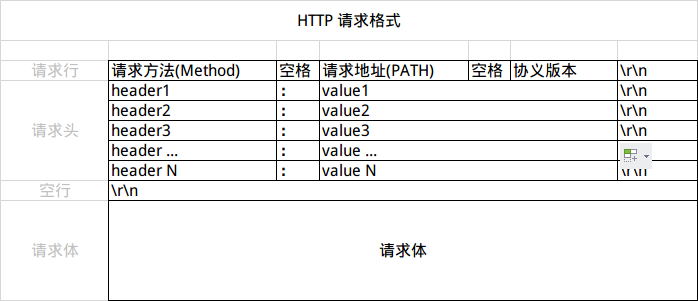
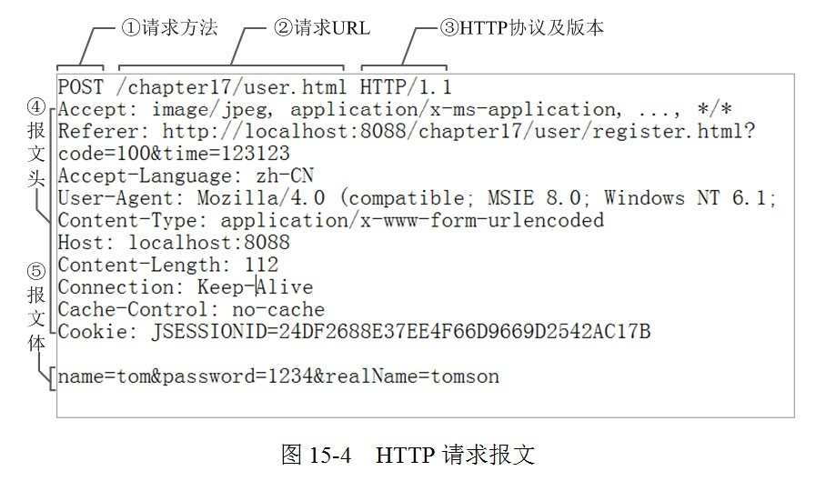
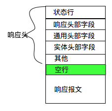
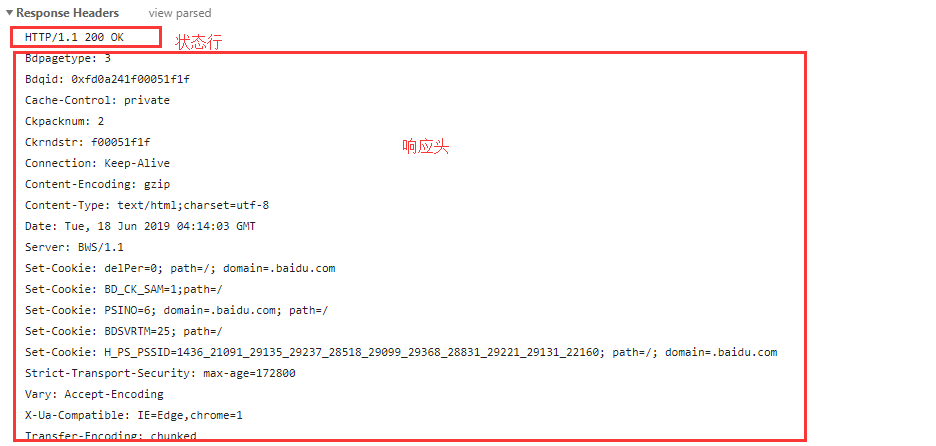

# HTTP 
HTTP协议全称是HyperText Transfer Protocol, 即超文本传输协议.目前普遍使用的版本为`HTTP/1.1`.

## HTTP报文结构
HTTP协议的作用是用来规范通信内容的,在HTTP协议中可以分为`请求报文`和`响应报文`.

1. 请求报文
    请求报文主要有三大部分: 
    1. `请求行` , 
    2. `请求头(Request Headers)`
    3. `空行`
    4. `请求体(Request Body)`  
    
    请求报文的结构如下图:
    

    例子:
    请求行结构: "方法 url 协议及版本"
    

2. 响应报文
    响应报文的结构与请求报文的结构类似,分为: 
    1. `状态行`
    2. `响应头(Respones Headers)`
    3. `空行`
    4. `响应体(Respones Body)`  
   
    响应报文的结构如下图:  
    

    例子:
    状态行结构: "协议及版本 状态码 状态原因短语"
    

## 报文头字段解析
报文头的编码方式是`ASCII`编码
1. 通用头部字段(General Header Fields)
    
    该类字段在请求头和响应头都会使用到
    - Cache-Control 缓存控制, 常见的值有
        - no-cache 不对资源/响应缓存
        - no-store 缓存不能在本地存储
        - max-age 资源缓存的最大时间
        - only-in-cached 客户端表示仅请求缓存服务器上的内容,若没有则返回504
    - Connection 管理持久连接, 常见的值有
        - keep-alive 保持持久连接
        - close 关闭
    - Transfer-Encoding 传输过程中采用的编码方式, 常见的值有:
        - chunked 分块编码
    - Via 追踪请求和响应报文传输路径, 报文经过代理或者网关会在此添加该服务器的信息然后再转发
2. 请求头部字段(Request Header Fields)
    - Accept    通知服务器,客户端能够处理的媒体类型.用`type/subtype`这种形式来指定
        - eg: text/html,application/xml;q=0.9,image/webp,*/*;q=0.8
    - Accept-Encoding 通知服务器, 客户端支持的内容编码
        - gzip(GNU zip), defalte(zlib压缩), indetity(不执行压缩)
    - Accept-Language 通知服务器, 客户端可处理的自然语言集,以逗号分割`q`代表优先级
        - zh-CN,zh;q=0.8,en;q=0.6  zh-CN优先级1,zh优先级0.8,en优先级0.6
    - Authorization 客户端的认证信息, 如果没填则会返回 401
    - If-Match 与 If-None-Match 对响应头的ETag字段匹配, 如果匹配成功则执行处理请求
    - If-Modified-Since 与 If-Unmodified-Since  如果该日期后发生资源更新,服务器则处理该请求
        - If-Modified-Since: Fir, 30 Dec 2016 02:46:44 GMT
    - If-Range  与Etag匹配,如果匹配成功,则按`Range`字段返回内容, 否则返回全部内容
        - If-Range: "etag_code" 
    - Referer   发起请求的URI
    - User-Agent    浏览器和用户代理名称等信息

3. 响应头部字段(Respones Header Fields)
    - Accept-Ranges 通知客户端,服务器是否支持范围请求
        - btyes 支持范围请求
        - none 不支持范围请求
    - Age   通知客户端, 服务器多久前创建了该响应
    - Etag  服务器资源所对应的一个独有的字符串, 当资源更新时Etag也会更新.结合请求头中的If-Match等逻辑请求头,可以判断客户端已经加载的资源在服务端是否更新过, 如果更新过时才对其处理.
    - Location  重定向的URL
    - Server    服务器型号,技术
    - Vary  对缓存进行控制, 通过该字段,原服务器回想代理服务器传达关于本地缓存使用方法的命令.
        - Accept-Encoding   返回的缓存要以Accept-Encoding为准
4. 实体头部字段(Content Header Fields)
    - Allow 通知客户端, 服务器这边所支持的所有请求方法
        - GET,POST,HEAD,PUT,DELETE
    - Content-Encoding  报文实体的编码方式
    - Content-Language  报文实体使用的自然语言
    - Content-Length    报文实体的字节长度
    - Content-MD5       对报文实体MD5加密后在使用Base64进行编码的字符串, 用来简单的校验报文是否被修改过

5. Cookie相关的头部字段
    - Set-Cookie  响应报文返回的的使用分号分隔的字符串, 内容具体字段如下
        - 键值对   abc=123  存放cookie中的信息, 可以是多个键值对,使用逗号间隔
        - max-age 多少秒后过期
        - expire  过期时间,若不指定该属性,关闭浏览器即失效
        - Domain  域名
        - path    用于限制指定cookie的发送范围的文件目录
        - httponly 可以使js脚本无法获取cookie, 可以防止XSS(跨站脚本攻击)对cookie信息的窃取
        - Secure  只在HTTPS通信时才发送Cookie
        - sameSite Strict Lax None
    - Cookie    浏览器自动加上该域名的Cookie发给服务端

## HTTP请求方法及响应状态码

1. 请求方法有以下几种:
    - GET 获取资源
        1. 从服务器获取资源, 参数拼接在URI上
        2. 浏览器回退时是无害的
        3. 唯一会被浏览器主动缓存的方法
        4. 由于参数是在URL上传递, 所以参数长度有限制, 编码有限制, 且不安全
    - POST 数据提交
        1. 一般用于表单提交, 数据塞到请求体中
        2. 浏览器回退时会再次提交请求
        3. 在RESTful API的设计中, POST请求是不幂等的
        4. 大多数浏览器POST请求会分两部分发送:
           1. 先发header部分, 服务器返回`100`
           2. 收到`100`后, 在继续发送body部分
    - PUT 上传文件
        1. 一般用于上传文件, 把文件内容塞到请求报文中, 但是因为`PUT方法不带验证机制`,所以存在安全性; 在设计Restful标准的接口时, 可以使用PUT来做对应内容的更新
        2. 幂等
    - HEAD 获得响应报文头
        1. 获取对应的响应头,不会获得响应体
    - DELETE 删除文件
        1. 删除URI指定的资源, 但是与PUT类似`不带验证机制`, 在Restful中可以用来做相关API的删除功能.
    - OPTIONS 查询支持的方法
        1.  用来查询服务器可对那些请求方法做出相应，返回内容就是响应端所支持的方法。
    - TRACE 追踪路径
        1. 可以追中请求经过的代理路径, Max-Forward字段...
    - CONNECT 要求用隧道协议代理连接
        1. 当浏览器配置使用代理服务器时才会用到这个方法

2. 响应状态码

    响应状态码有以下几类:
    - 1xx ---- Informational（信息性状态码），表示接受的请求正在处理。
    - 2xx ---- Success (成功)，表示请求正常处理完毕。
    - 3xx ---- Redirection (重定向)，表示要对请求进行重定向操作，当然其中的304除外。
    - 4xx ---- Client Error (客户端错误)，服务器无法处理请求。
    - 5xx ---- Server Error (服务器错误)，服务器处理请求时出错。

    常用的响应状态码有:
    1. 100  --- Continue --- 客户端继续请求, POST请求先发送Header, 服务端返回100后,再继续发送body部分
    2. 101  --- Switching Protocols  --- 切换协议, 服务器根据客户端的请求切换协议
    3. 200  --- OK --- 请求成功.
    4. 202  --- Accepted --- 已接受请求,但未处理完成
    5. 204  ---	No Content --- 已处理成功,但未返回内容
    6. 301  --- Moved Permanently --- 永久性重定向, 若之前的URI保存在书签中,则更新为新的URI代替
    7. 302  --- Found --- 临时重定向, 不会修改书签内容
    8. 304  ---	Not Modified --- 未修改. 所请求的资源未修改,不返回任何资源,客户端将访问缓存里的资源
    9. 400  ---	Bad Request --- 错误请求, 请求报文中包含语法错误
    10. 401 --- Unauthorized --- 请求未认证
    11. 403 --- Forbidden --- 服务器拒绝执行该请求
    12. 404 --- Not Found --- 服务器无法根据客户端的请求找到资源
    13. 405 ---	Method Not Allowed --- 客户端请求的方法被禁止
    14. 413 --- Payload Too Larg --- 请求体载荷过大
    15. 500 --- Internal Server Error --- 服务器内部错误,处理请求是发生异常
    16. 502 ---	Bad Gateway --- 网关或代理服务器出错
    17. 503 --- Service Unavailable --- 服务不可用, 服务器超载/维护,无法处理客户端请求

## HTTP/2
HTTP/1.1 版的头信息肯定是文本（ASCII编码），数据体可以是文本，也可以是二进制.
而HTTP/2是一个二进制协议

特点:
1. 二进制协议 frame
    > 头信息和数据体都是二进制,且统称为`frame(帧)`:头信息帧和数据帧.  
    多个帧组成一个流.
2. 多工 Multiplexing
    > 复用TCP连接, 在`相同域名`请求下可以只建立同一个TCP连接,客户端和浏览器都可以同时发送多个请求, 且不用按照顺序一一对应, 避免了"队头阻塞".  
    >
    >可以先处理处理一部分A请求,在响应B请求,完成后再发送A请求剩下的部分.
    这样双向的、实时的通信叫`多工`
3. 数据流 stream
    > 由于HTTP/2的数据包不是按顺序发送的, 同一个连接里的连续的数据包,有可能属于不同的请求/响应.因此需要对数据报进行标记.
    > 
    >HTTP/2将同一个请求/响应的所有数据包,称为一个数据流(stream), 每个数据报发送的时候都必须标记数据流ID, 客户端ID奇数, 服务端ID偶数.
    >
    > 这种机制下,HTTP/2可以取消某个数据流而还维持TCP的连接,HTTP/1.1取消的唯一方法师关闭TCP连接;而且客户端也可以指定数据流的优先级 

4. 头信息压缩 header compression
    > HTTP/2 通过gzip压缩头信息与通过维护一张头信息表, 后续的请求不需要在发送cookie与User Agent信息,节约了带宽,提高了速度, 这个机制就是`头信息压缩机制`
5. 服务器推送 server push
    > 允许服务器未经请求,主动向客户端发送资源

## 参考
- [HTTP灵魂之问，巩固你的 HTTP 知识体系](https://juejin.im/post/5e76bd516fb9a07cce750746)