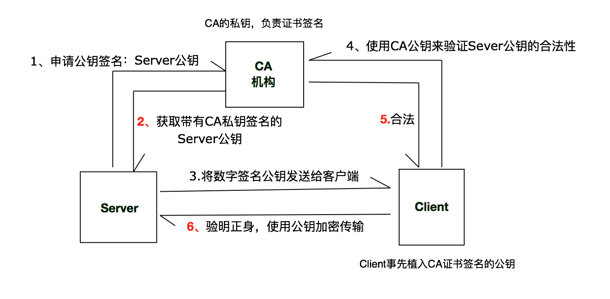
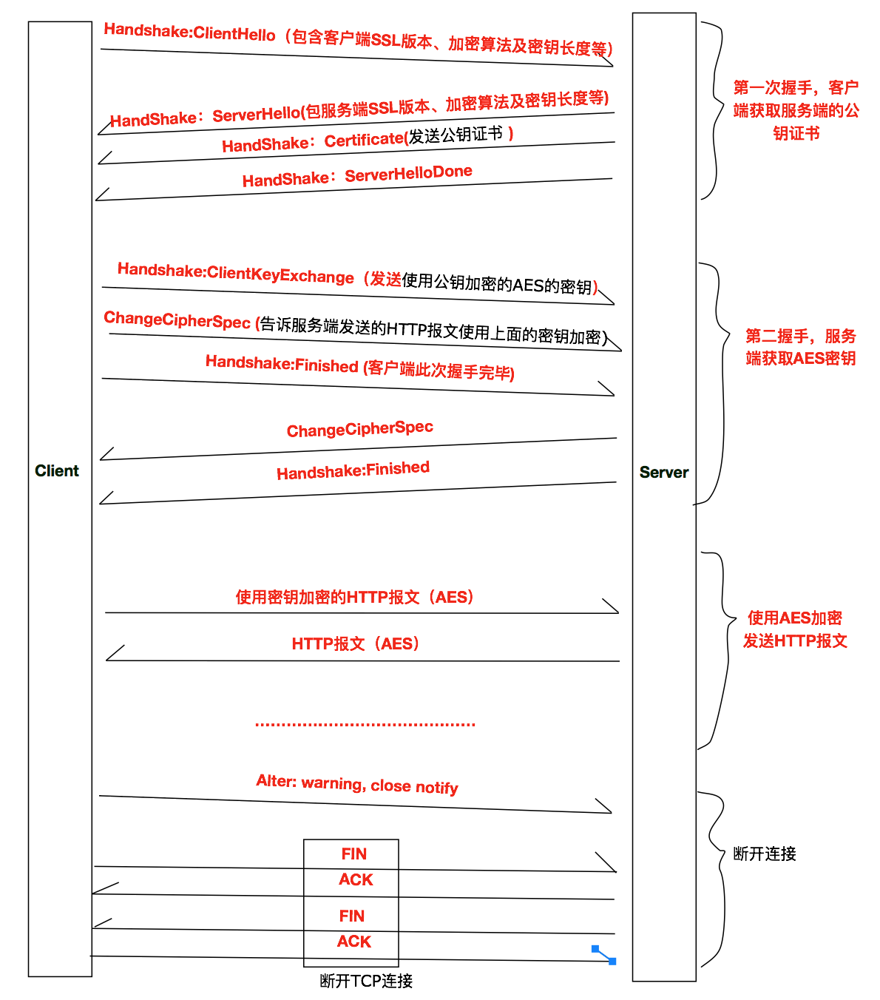

# HTTPS
准确来说HTTPS并非是一种协议, 而是`HTTP+SSL/TSL`的结合体.

HTTPS就是在HTTP层与TCP层中间添加了一个SSL层,因为多了加密的流程, 所以HTTPS的速度要比HTTP慢.

## CA证书
SSL层加密主要采用的是RSA(非对称加密)与AES(对称加密)结合的加密方式.
在建立连接时服务器需要用到RSA把通信时的密钥发送给客户端, 但是如何确保客户端收到的密钥是没有被篡改过的呢?

这时候就需要有一个公正的机构来证明客户端收到的密钥就是服务器发送的密钥.这个中间认证机构就是数字证书认证机构,其颁发的证书就是`CA证书(Certificate Authority)`.

CA证书的签名,分发,验证过程:
1. 服务端使用RSA算法生成公钥与私钥, 公钥需要向`CA机构`申请进行数字签名, 得到数字签名公钥证书, 得到签名猴的证书才能分发给客户端.
2. 生成数字签名公钥证书: 对CA机构来说, 其实也有两个密钥(`CA公钥`和`CA私钥`).CA机构把服务端的公钥作为输入参数转换成一串hash值,然后使用CA私钥将这个hash值进行加密处理,并与服务端的公钥绑定在一起,生成数字签名证书.所以数字签名证书的本质就是`服务端的公钥+CA私钥加密的hash值`. (`CA私钥负责签名,CA公钥负责验证`)
3. 服务器获取到这个证书以后,把证书发送给客户端.当客户端收到数字证书后,会验证其有效性,大部分客户端都会预装`CA机构的公钥`.客户端使用CA公钥对数字证书上的签名进行验证,验证过程就是使用`CA公钥对CA私钥加密的内容进行解密`,将`解密后的内容`与服务端的公钥所生成的Hash值进行匹配,匹配成功则是合法证书
4. 验证服务端公钥合法后,就可以使用公钥进行加密通信

## HTTPS安全通信机制
HTTPS与HTTP的主要差异在于SSL/TSL,

SSL -- 安全套节层(Secure Socket Layer),TSL(Transport Layer Security 安全传输层)是以SSL为原型开发的协议.

下面我们主要说一下SSL的加密过程, 主要可以分为四步:
> 1. 客户端发起第一次握手, 为了获取服务端的数字签名证书, 服务端在响应之前先确认客户端的SSL版本,加密算法等信息, 客户端获取数字签名证书后校验证书合法性.
> 2. 客户端发起第二次握手, 为了将AES加解密使用的KEY发送给服务端.这个`AES_KEY`是使用第一次握手获取证书中的公钥进行加密的.服务端收到这个使用公钥加密后的AES_KEY,使用私钥解密, 这样客户端和服务端都持有用于AES解密的KEY.
> 3. 客户端与服务端都吃用AES_KEY后, 就可以对HTTP报文进行加/解密了.
> 4. 断开连接, 此步骤就是TCP的[四次挥手](./TCP_IP协议族.md#四次挥手)

