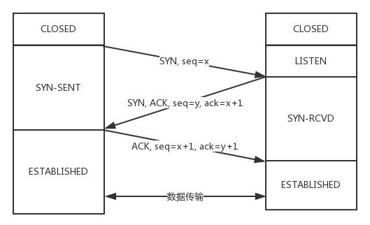
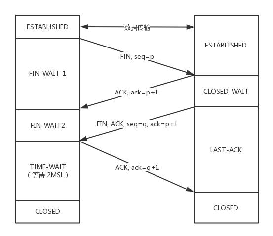

# TCP/IP协议族
TCP/IP其实并非就只是指TCP和IP这两个协议,而是指与其相关的各种协议.如:HTTP,FTP,DNS,TCP,UDP,IP,SNMP等等,都属于TCP/IP协议族的范畴.

## TCP/IP协议的分层
1. OSI模型

    TCP/IP协议族是分层管理的, 在OSI模型中可以分为7层(应用层,表示层,会话层,传输层,网络层,数据链路层,物理层, 简记为`应表会传网数物`).
    - 应用层    (HTTP)
    - 表示层    负责数据压缩,解压,加密,解密
    - 会话层    (SSL/TLS)
    - 传输层    (TCP, 报文)
    - 网络层    (IPv4, 由帧组成的数据包)  
    - 数据链路层 (传输数据帧, 协议: 以太网)
    - 物理层    (传输物理信号/bit), 协议: 网络电缆/ wifi)
2. TCP/IP模型

    但是OSI模型的分层粒度太细了,我们又可以根据对于TCP / IP模型把它分为四层(应用层, 传输层, 网络层, 链路层). 下面对每一层简单介绍一下:
    >- `应用层`: 这是面向用户的一层,用户是可以直接操作该层的.我们常见的`HTTP(HyperText Transfer Protocol:超文本传输协议)`, `FTP(File Transfer Protocol:文件传输协议)`和`DNS(Domain Name System: 域名系统)`都属于应用层, 在OSI模型中, 这一层又可以分为`应用层,表示层,会话层`. 这一层决定了向用户提供应用服务时的通信活动.
    >
    >- `传输层`: 应用层会将数据交给传输层进行传输. `TCP(Transmission Control Protocol: 传输控制协议)`和`UDP(User Data Protocol:用户数据报协议)`位于这一层. TCP建立连接时需要三次握手来确认连接情况, 断开连接时需要四次挥手才能安全断开. 而UDP不需要这些过程.这一层是用来提供处于网络连接中的两台计算机直接的数据传输.
    >
    >- `网络层`:网络层是用来处理网络上流动的数据包, `IP(Internet Protocol:网际协议)`就是位于这一层. 该层负责在总舵网络线路中选择一条传输线路, 期间需要IP地址和MAC地址的支持.  
    ps: ARP协议是根据IP获得MAC地址的协议, 恶意伪造MAC地址,可能造成局域网广播灾难.
    >
    >- `链路层`: 链路层主要用来处理网络的硬件部分, 在OSI模型中这一层又分为`数据链路层和物理层`. 网卡与光纤就是数据这一层的.

    简单的封包/解包过程如下图:
    

## TCP

### 常见场景
FTP,HTTP协议的传输层协议, 收发邮件, 远程登录等准确性要求高的场景

### 特点

1. 需要连接(`三次握手`)
2. 数据不丢失,不重复,按序到达
3. 只支持1对1通信

### 三次握手
为了确保传输的可靠性,TCP在建立连接时需要三次握手.
- 第一次握手: 客户端给服务端发一个 `SYN` 报文，并指明客户端的初始化序列号 `ISN(x)`。此时客户端处于 `SYN_SENT` 状态。  
首部的同步位SYN=1，初始序号seq=x，SYN=1的报文段不能携带数据，但要消耗掉一个序号。
- 第二次握手: 服务器收到客户端的 `SYN` 报文之后，会以自己的 `SYN` 报文作为应答，并且也是指定了自己的初始化序列号 `ISN(y)`。同时会把客户端的 `ISN + 1` 作为 `ACK` 的值，表示自己已经收到了客户端的 `SYN`，此时服务器处于 SYN_RCVD 的状态。  
在确认报文段中SYN=1，ACK=1，确认号ack=x+1，初始序号seq=y。

- 第三次握手: 客户端收到 `SYN` 报文之后，会发送一个 `ACK` 报文，当然，也是一样把服务器的 `ISN + 1` 作为 `ACK` 的值，表示已经收到了服务端的 `SYN` 报文，此时客户端处于 `ESTABLISHED` 状态。服务器收到 `ACK` 报文之后，也处于 `ESTABLISHED` 状态，此时，双方已建立起了连接。

确认报文段ACK=1，确认号ack=y+1，序号seq=x+1（初始为seq=x，第二个报文段所以要+1），ACK报文段可以携带数据，不携带数据则不消耗序号。

### 四次挥手
为了确保传输的可靠性,TCP在关闭连接的时候需要四次挥手来确保数据传输完整.
- 第一次挥手：第一次挥手：客户端发送一个 `FIN` 报文，报文中会指定一个序列号。此时客户端处于 `FIN_WAIT1` 状态。
即发出连接释放报文段（FIN=1，序号seq=u），并停止再发送数据，主动关闭TCP连接，进入FIN_WAIT1（终止等待1）状态，等待服务端的确认。
- 第二次挥手：服务端收到 FIN 之后，会发送 ACK 报文，且把客户端的序列号值 +1 作为 ACK 报文的序列号值，表明已经收到客户端的报文了，此时服务端处于 CLOSE_WAIT 状态。
即服务端收到连接释放报文段后即发出确认报文段（ACK=1，确认号ack=u+1，序号seq=v），服务端进入CLOSE_WAIT（关闭等待）状态，此时的TCP处于半关闭状态，客户端到服务端的连接释放。客户端收到服务端的确认后，进入FIN_WAIT2（终止等待2）状态，等待服务端发出的连接释放报文段。

- 第三次挥手：如果服务端也想断开连接了，和客户端的第一次挥手一样，发给 FIN 报文，且指定一个序列号。此时服务端处于 LAST_ACK 的状态。
即服务端没有要向客户端发出的数据，服务端发出连接释放报文段（FIN=1，ACK=1，序号seq=w，确认号ack=u+1），服务端进入LAST_ACK（最后确认）状态，等待客户端的确认。

- 第四次挥手：客户端收到 FIN 之后，一样发送一个 ACK 报文作为应答，且把服务端的序列号值 +1 作为自己 ACK 报文的序列号值，此时客户端处于 TIME_WAIT 状态。需要过一阵子以确保服务端收到自己的 ACK 报文之后才会进入 CLOSED 状态，服务端收到 ACK 报文之后，就处于关闭连接了，处于 CLOSED 状态。
即客户端收到服务端的连接释放报文段后，对此发出确认报文段（ACK=1，seq=u+1，ack=w+1），客户端进入TIME_WAIT（时间等待）状态。此时TCP未释放掉，需要经过时间等待计时器设置的时间2MSL后，客户端才进入CLOSED状态。

为什么需要等待`2MSL`? 
- 防止“已失效的连接请求报文段”出现在本连接中.
- 保证客户端发送的最后一个ACK报文段能够到达服务端。
## UDP

### 常见场景
即时聊天(QQ), 在线视频, 大型多人在线游戏 等高实时性要求的场景

### 特点

1. `无连接`协议, 发送数据之前不需要建立连接
2. 不保证不会丢包
3. 支持n对n的交互通信
4. 实时性好, 工作效率高, 系统资源要求少

## 参考
- [面试官，不要再问我三次握手和四次挥手](https://blog.csdn.net/hyg0811/article/details/102366854)
- [TCP协议灵魂之问，巩固你的网路底层基础](https://juejin.im/post/5e527c58e51d4526c654bf41#heading-21)